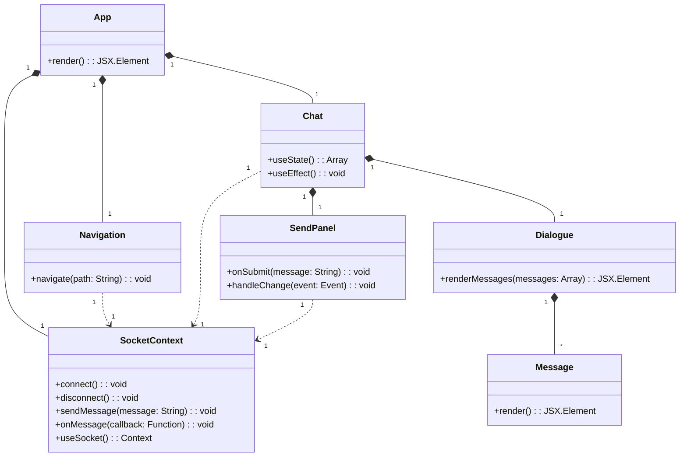
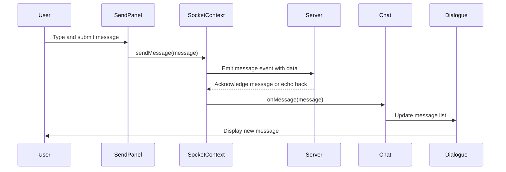

# SPARA Web Client
The client interface for the chatbot is implemented using ReactJS and is integral part of the main SPARA bundle.

# Installation

## Requirements

[NodeJS](https://nodejs.org/en/download/package-manager)

## Installing packages

`npm install`

## Running the client

`npm run dev`

# Documentation
## Class diagram
- **App**: The root component, rendering the overall application, possibly including `Navigation` and `Chat`.
- **SocketContext**: A context for managing the WebSocket connection, providing methods to connect, disconnect, send, and listen for messages.
- **Navigation**: Manages navigation between different pages or views within the app.
- **Chat**: The main chat interface, managing state for messages and connecting `SendPanel` and `Dialogue`, interacting with `SocketContext` for getting messages
- **SendPanel**: The input component where users type and submit messages, interacting with `SocketContext` for sending messages.
- **Dialogue**: Manages displaying the list of messages, with each message being a `Message` component.
- **Message**: Represents a single chat message.

### Sequence diagram
1. User sending a message via SendPanel.
2. SendPanel sending the message through SocketContext.
3. SocketContext handling the message and sending it to the server.
4. Server response with the message echoed back.
5. SocketContext receiving the message and updating Chat to display it in Dialogue.
